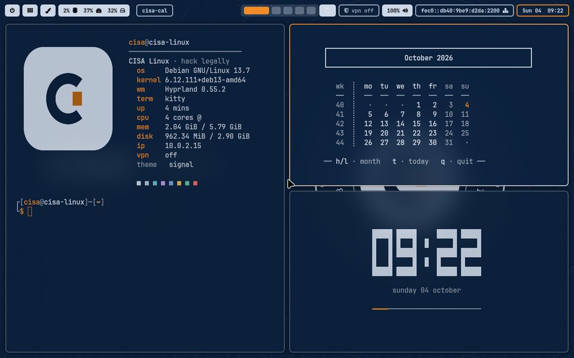
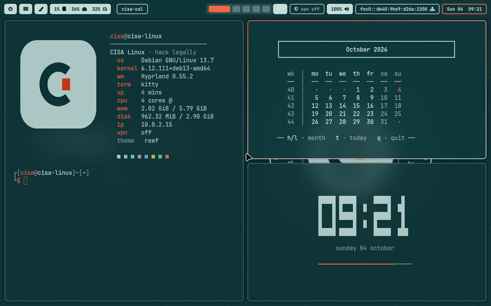
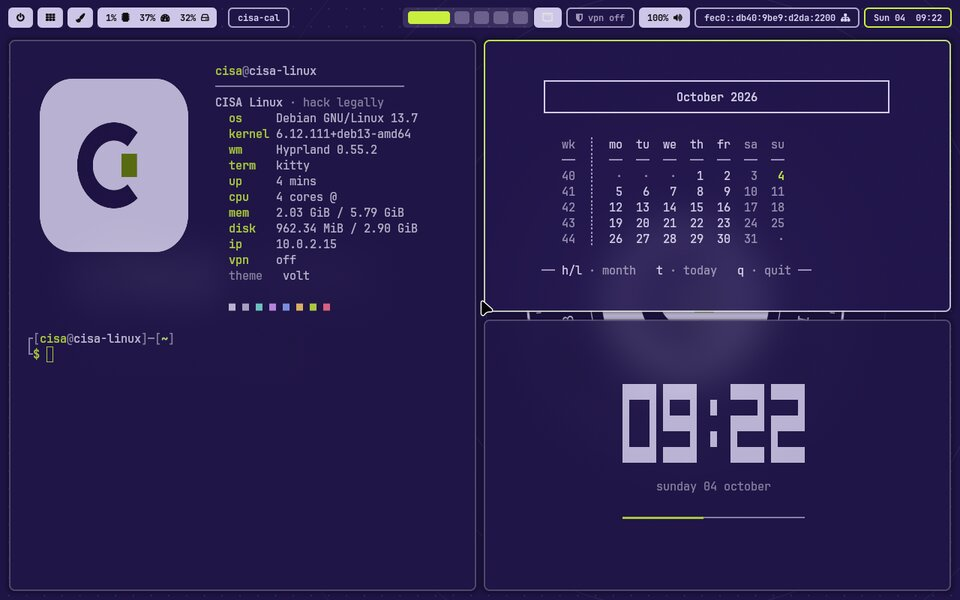
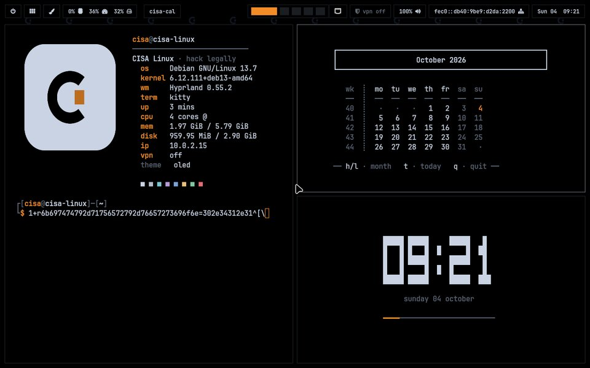
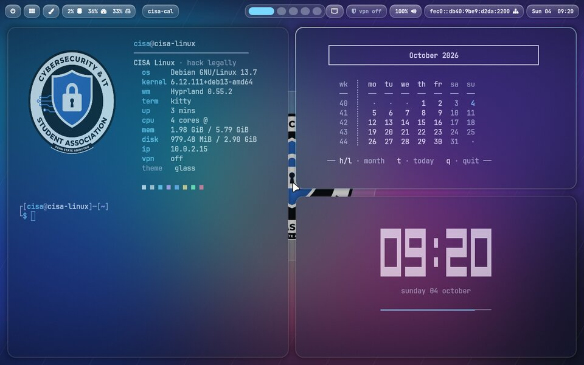
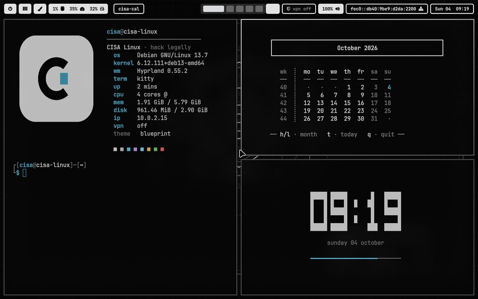
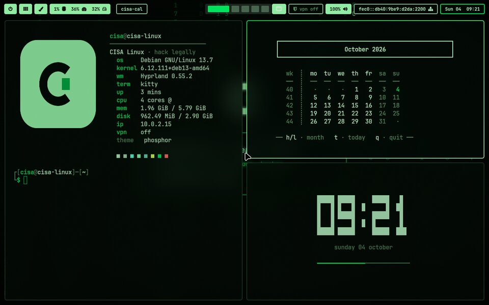
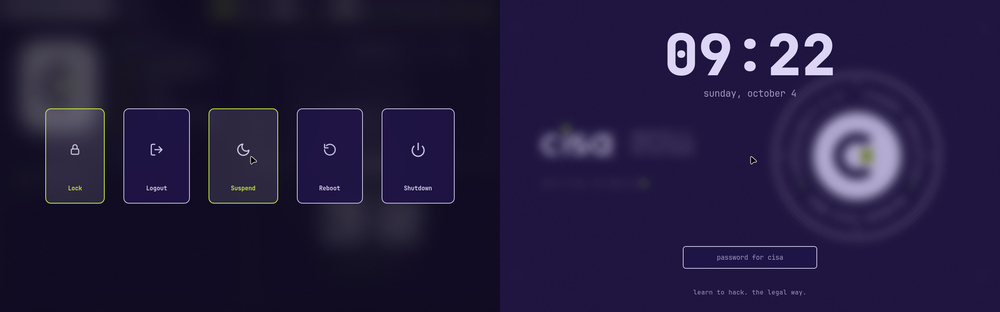

# CISA Rice

A fully riced **Hyprland** desktop for CISA Linux, with nine themes, all switchable with one command.
It themes the beginner-friendly Plasma desktop to match, so you can pick either one on the login screen.

*From the Cybersecurity & IT Student Association, Penn State Abington. Learn to hack. The legal way.*

## Install

Open a terminal and paste:

```bash
curl -fsSL https://raw.githubusercontent.com/psu-abington-cisa/cisa-rice/main/install.sh | bash
```

Pick a theme and type your password once to install the packages. Then **log out, choose "Hyprland"
on the login screen** (bottom-left), and log back in.

Everything comes from Debian. Hyprland, hyprlock and hypridle are installed from Debian 13's official
`trixie-backports` archive (Debian-signed). Nothing is downloaded from random websites.

## Themes

| | | |
|---|---|---|
|  **CISA Navy**: club colors and the badge |  **Signal**: navy and signal orange |  **Reef**: deep teal and coral |
|  **Volt**: violet and chartreuse |  **Daylight**: light, blue and orange |  **OLED**: true black, no glow |
|  **Glass**: glossy frosted glass |  **Blueprint**: monochrome engineering drawing |  **Phosphor**: CRT terminal green |



Signal, Reef, Volt, Daylight and OLED use the palettes, the **ci** mark, the **cisa** wordmark and the
seal from the CISA logo concepts. The badge is redrawn as a pure vector
([`assets/cisa-logo.svg`](assets/cisa-logo.svg)), so it's sharp at every size.

## What you get

- **Hyprland:** tiling windows with gaps, borders and blur, plus smooth animations.
- **Waybar:** boxed monospace modules (power, apps, theme, CPU/RAM/disk, temperature, window title,
  workspaces, tray, volume, network, battery, clock). There's also a **VPN module** that lights up
  with your TryHackMe/OffSec `tun0` IP; click it to copy the IP for `LHOST`.
- **Launcher, power menu and notifications:** fuzzel, wlogout and swaync, all matching the theme.
- **Lock screen:** hyprlock with a big clock, plus hypridle (locks after 5 minutes).
- **Terminal:** kitty with fastfetch showing the CISA mark (sharp, via the kitty image protocol), and a
  starship prompt that shows your VPN IP.
- **TUI apps:** btop, cava, a big clock and a calendar, all themed. **Super+D** opens the dashboard
  (system info, clock and calendar, tiled).
- **Plasma:** gets the same colors, wallpaper, lock screen, login screen and Konsole colors.

## Keys (Super = the Windows key)

| Keys | Does |
|---|---|
| **Super** | open apps (like the Start menu) |
| Super + / | **show every shortcut on screen** |
| Super + Enter | terminal |
| Super + E / B | files / browser |
| Alt + F4, Super + Q | close window |
| Alt + Tab | switch windows |
| Super + L | lock |
| Super + X | power menu |
| Super + V | clipboard history |
| Super + Shift + S, Print | screenshot |
| Super + 1…9 | desktops |
| Super + D | dashboard |
| Super + Shift + T | change theme |

## Options

```bash
~/.local/share/cisa-rice/app/rice.sh --list
~/.local/share/cisa-rice/app/rice.sh --theme glass
~/.local/share/cisa-rice/app/rice.sh --theme daylight --layout win11   # also restyle the Plasma taskbar
~/.local/share/cisa-rice/app/rice.sh --restore                          # undo everything
```

Your own Hyprland tweaks go in `~/.config/hypr/user.conf`. CISA Rice never overwrites that file.
Set `export CISA_NO_FETCH=1` in `~/.bashrc` to skip the terminal banner.

## Make your own theme

Copy a file in [`themes/`](themes/), change the colors, then run `rice.sh --theme <file-name>`:

```bash
NAME="My Theme"; DESC="One line for the picker"
DARK=1; STYLE="solid"                  # solid | glass | oled | blueprint
BG="#0b1f3a"; SURFACE="#122a4a"; PANEL="#dce6f5"; FG="#dce6f5"; MUTED="#99a6b9"; LINE="#4a5b72"
ACCENT="#f28c28"; ACCENT2="#ffb066"
RED="#ff6b6b"; GREEN="#5fd3a5"; YELLOW="#f2c14e"; BLUE="#7fa8e8"; MAGENTA="#c7a0f0"; CYAN="#6fc8d8"
MARK="ci"; MOTIF="seal"                # badge | seal | oled | aurora | blueprint | phosphor
WIN_OPACITY="0.95"; TERM_OPACITY="0.9"; BLUR=1; RADIUS=6; BORDER=2; GAPS_IN=5; GAPS_OUT=12
ICONS="Papirus-Dark"; CURSOR="Bibata-Modern-Ice"
```

## Layout

| Path | What |
|---|---|
| `rice.sh` | installs packages, applies a theme, backs up and restores |
| `lib/render.py` | renders every config and the artwork for a theme |
| `lib/configs.py` | Hyprland, Waybar, fuzzel, wlogout, swaync, kitty, btop, cava, fastfetch, starship, KDE |
| `lib/art.py` | marks, seal and wallpapers (SVG, rendered at 4K) |
| `bin/` | `cisa-theme`, `cisa-keys`, `cisa-dashboard`, `cisa-cal`, `cisa-clock`, `cisa-power`, `cisa-vpn`, `cisa-shot`, `cisa-clip` |
| `dev/vm-test.sh` | boots CISA Linux in QEMU, installs, logs into Hyprland, screenshots every theme |

Requires [CISA Linux](https://github.com/psu-abington-cisa/cisa-linux) or any Debian 13 system with KDE Plasma.
