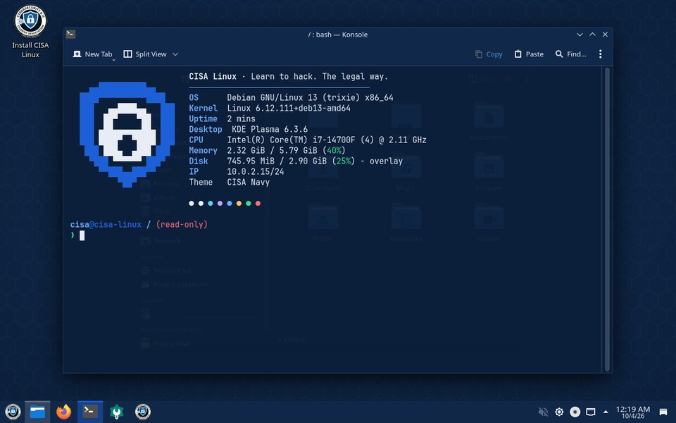
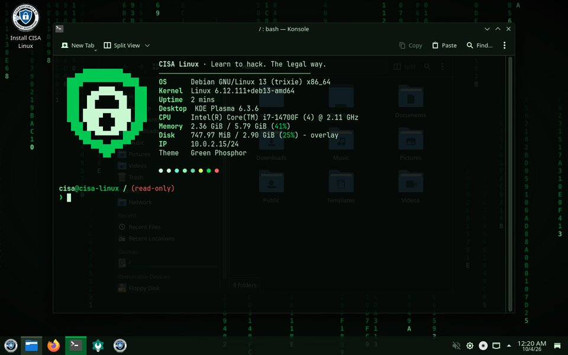
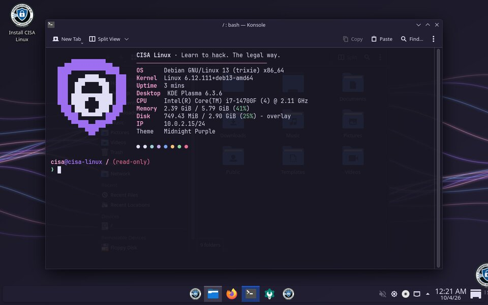
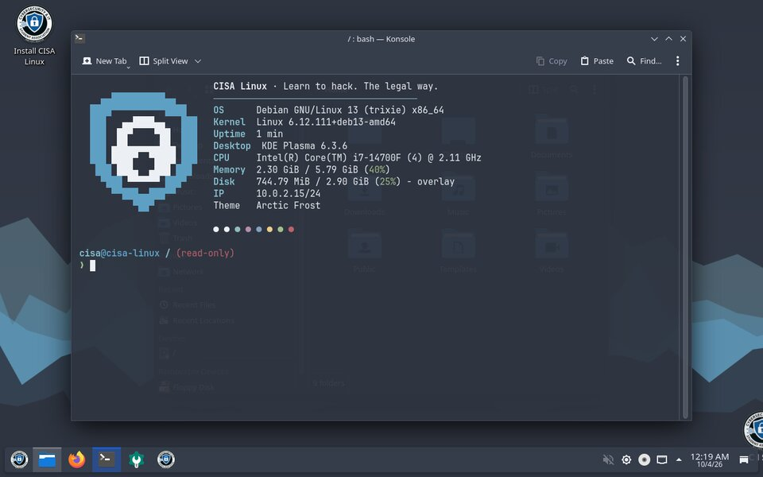
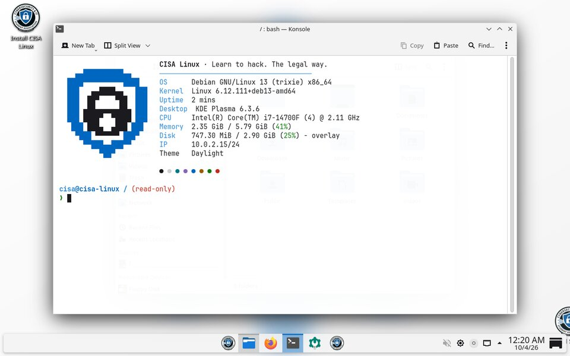

# CISA Rice 🎨

One command to make your CISA Linux desktop look great.
Pick from five themes, and switch or undo any time.

*From the Cybersecurity & IT Student Association, Penn State Abington. Learn to hack. The legal way.*

## Install

Open **Konsole** (the terminal on your taskbar) and paste:

```bash
curl -fsSL https://raw.githubusercontent.com/psu-abington-cisa/cisa-rice/main/install.sh | bash
```

A window pops up so you can pick a theme and a taskbar style. It may ask for your password once,
to install the icon, cursor and font packages.

After that, you can change themes from **Start menu → CISA Themes**.

## Themes

| Theme | Look | Taskbar |
|---|---|---|
| `cisa-navy` | **CISA Navy**: the official club colors, deep navy and Penn State blue, with the CISA badge | Windows 10 style |
| `green-phosphor` | **Green Phosphor**: hacker-movie terminal, black glass and falling green code | Windows 10 style |
| `midnight-purple` | **Midnight Purple**: late-night CTF vibes, deep purple with neon waves | Windows 11 style |
| `arctic-frost` | **Arctic Frost**: calm and easy on the eyes, cool slate and ice blue | Windows 10 style, floating |
| `daylight` | **Daylight**: bright and familiar, a light theme like Windows 11 | Windows 11 style |

| | |
|---|---|
|  **CISA Navy** |  **Green Phosphor** |
|  **Midnight Purple** |  **Arctic Frost** |
|  **Daylight** | |

Each theme sets:

- **Colors** for every app, window and menu, plus a matching accent color
- **Wallpaper** for the desktop, lock screen and login screen, drawn fresh for each theme
- **Icons** (Papirus) and **mouse cursor** (Bibata)
- **Taskbar**: Windows 10 style (left) or Windows 11 style (centered and floating). Your pinned apps are kept.
- **Terminal**: matching colors, the JetBrains Mono font, a slightly see-through background, a CISA system-info
  banner (fastfetch), and a prompt that **shows your VPN IP when you're connected to TryHackMe or OffSec**

## Options

```bash
~/.local/share/cisa-rice/app/rice.sh --list                 # show themes
~/.local/share/cisa-rice/app/rice.sh --theme daylight       # apply without the picker
~/.local/share/cisa-rice/app/rice.sh --theme cisa-navy --layout win11
~/.local/share/cisa-rice/app/rice.sh --no-terminal          # leave the terminal banner/prompt alone
~/.local/share/cisa-rice/app/rice.sh --restore              # undo everything
```

Don't want the banner every time you open a terminal? Add `export CISA_NO_FETCH=1` to `~/.bashrc`.

## Undo

The first run saves a copy of your settings. `rice.sh --restore` puts them back,
including the terminal setup in `~/.bashrc`.

## Make your own theme

Copy a file in `themes/`, change the colors, and run `rice.sh --theme your-file-name`.
Pull requests with new themes are welcome!

```bash
NAME="My Theme"
DESC="One line shown in the picker"
DARK=1                                   # 0 for a light theme
BG="#0b1f3a"; SURFACE="#10284a"; FG="#e8edf5"; MUTED="#8494b0"
ACCENT="#1d5fd6"; ACCENT2="#6ea8fe"
RED="#ff6b7d"; GREEN="#3ddc97"; YELLOW="#ffc266"; BLUE="#6ea8fe"; MAGENTA="#c4a1ff"; CYAN="#5ad1e6"
ICONS="Papirus-Dark"; CURSOR="Bibata-Modern-Ice"
LAYOUT="win10"; FLOAT=0                  # win10 | win11, floating taskbar 0/1
MOTIF="badge"                            # wallpaper: badge | matrix | waves | mountains | bloom
TERM_OPACITY="0.95"
```

## Requirements

[CISA Linux](https://github.com/psu-abington-cisa/cisa-linux), or any Debian 13 / KDE Plasma 6 system.
It's tested on CISA Linux 2026.10 (`dev/vm-test.sh` boots the ISO in QEMU and screenshots every theme).
